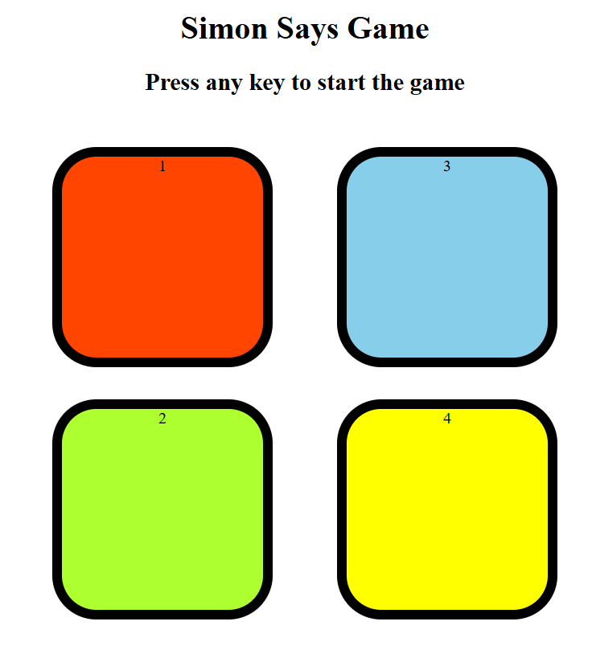
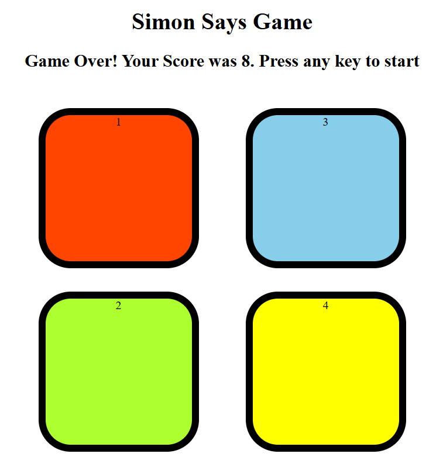

# Simon Says Game 🎮

A fun and interactive **Simon Says memory game** built using **HTML, CSS, and JavaScript**.  
The goal is to follow and repeat an increasingly long sequence of colored button flashes.

---

## ✨ Overview

This project recreates the classic *Simon Says* game, testing memory and concentration skills.  
Players must correctly repeat the randomly generated sequence of colors to advance to higher levels.

- **Goal:** Repeat the sequence of flashing buttons as long as possible.  
- **Game Over:** If you press the wrong color, the game ends and shows your score.  

---

## 🚀 Live Demo

Play it here: [Simon Game Demo](https://lakshaylohan.github.io/simon-says-game/)

---

## 🧰 Tech Stack

- **HTML5** – Game structure  
- **CSS3** – Styling and button effects  
- **JavaScript (Vanilla)** – Game logic and interactivity  

---

## 📂 Project Structure
simon-game/
├─ index.html
├─ style.css
├─ script.js
├─ README.md
└─ assets

---

## ✨ Features

- Dynamic sequence generation  
- Interactive button flashes  
- Level progression system  
- Game Over screen with score display  

---

## 📸 Screenshots

### Gameplay


### Game Over Screen


---

## 🔧 How to Run Locally

1. Clone the repository:
   ```bash
   git clone https://github.com/lakshaylohan/simon-says-game.git
   cd simon-says-game

---

## 🙋‍♀️ Author

Made with ❤️ by **LakshayLohan**  
Github: [GitHub Profile](https://github.com/LakshayLohan)
📧 Email: lohanlakshay23@gmail.com
